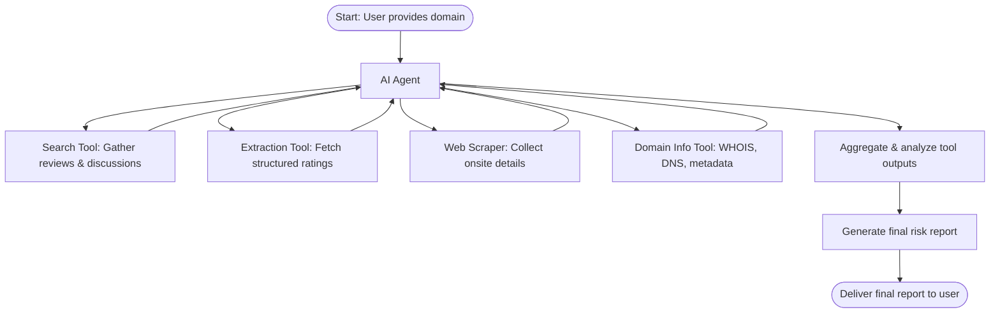

# 1. Overview
## 1.1 About R'ULegit
R'ULegit is an AI-powered agent designed to evaluate the legitimacy of e-commerce websites. It uses a set of specialized tools to collect information from trusted external sources, analyze risk indicators, and generate structured assessments. The agent provides users with an estimated risk level, supporting evidence, and relevant context to help them make informed decisions before engaging with a website.


## 1.2 Technical Concept
This system combines a backend AI orchestration engine with a browser extension frontend.
Users submit an e-commerce URL through the extension, and the backend—powered by LLMs and external intelligence tools—processes the request.

The backend retrieves website data, performs searches, checks reputation signals, analyzes page content, and synthesizes the findings into a structured response that includes rationale and confidence scoring.
The browser extension serves as a lightweight interface that displays these results in a clear and user-friendly format.

## 1.3 System Workflow


## 1.4 Project Structure
```css
rulegit/
│
├── src/
│   ├── prompts/
│   ├── tests/
│   ├── tools/  
│   ├── agent_workflow.py
│   └── app.py
│
├── extension/
|   ├── manifest.json
|    ├── background.js
|    ├── exchange.js
|    ├── index.html
|    └── index.css
|
|── requirements.txt
|── .env
└── README.md
```

---

# 2. AI Agent Architecture
## 2.1 Technology Stack
- Runtime: Python
- Framework: FastAPI 
- LLM Framework: LangChain / OpenAI API / Gemini API

## 2.2 Features
- Structured agent response schema
- Multi-tool support (search, scraping, page analysis)
- RAG (Retrieval-Augmented Generation) capability
- URL classification and scoring

## 2.3 Agent Logic & Tools
### Prompting
- Task description
- Tool availability
- Output schema enforcement
- Safety rules

#### Output Schema
```json
{
  "type": "object",
  "properties": {
    "Risk Level": {
      "type": "string",
      "enum": ["Low", "Medium", "High", "Mixed", "Critical"]
    },
    "Rationale": {
      "type": "array",
      "items": { "type": "string" }
    },
    "Confidence Level": {
      "type": "number",
      "minimum": 0,
      "maximum": 1
    }
  }
}
```
### Tools
#### Search Tool
Scans the web using the Tavily Search Toolkit to gather information about the target e-commerce domain. Extracts customer discussions from platforms such as Reddit, capturing reviews, community feedback, product issues, and reputation signals related to quality, service, and shipping.

#### Extraction Tool
Retrieves structured data through Diffbot from trusted review platforms such as Trustpilot. Extracts ratings, reviews, and credibility indicators in clean, machine-readable formats, enabling evaluation of external validation and website legitimacy.

### Web Scrapping Tool
Scrapes data directly from the target website or relevant third-party pages when search and extraction tools return limited results. Captures product listings, policy pages, business claims, security indicators, and other on-site trustworthiness signals.

### Domain Information Toool
Retrieves WHOIS records, DNS details, hosting metadata, and registration information through a domain-intelligence module. Identifies trust signals such as domain age, registrar reputation, privacy masking, ownership consistency, and red flags associated with newly created or suspicious domains.

## Workflow Diagram


## 2.4 API Endpoints
#### GET /health
Response
```json
{
    "message": "Service is up and running"
}
```

#### GET /validate_url
Params: [domain]

Request
```json
{
    "url": "example.com"
}
```
Response
```json
{
  "Risk Level": "Medium",
  "Rationale": [
    "Domain is newly created",
    "Limited third-party reputation signals"
  ],
  "Confidence Level": 82
}
```

# 3. Setup & Configuration
## 3.1 Backend - Configuration
1. Clone the repository:
```code
    git clone https://github.com/paulchimzy/rulegit.git
    cd rulegit
```

2. Configure .env file:
- Set API keys for chosen LLM providers (OpenAI)
- Set API keys for the different tools
    - TAVILY API KEY
    - DIFFBOT API KEY

3. Start the backend server
```code
cd rulegit/src
uvicorn app:app --host 0.0.0.0 --port 8000
```

4. Access the server health at http://localhost:8000/health
- The url validation uses the api at http://localhost:8000/validate_url?=domain_name

## 3.2 Browser Extension
### Load into Chrome
1. Go to chrome://extensions
2. Enable Developer Mode
3. Click Load Unpacked
4. Select the extension/ folder